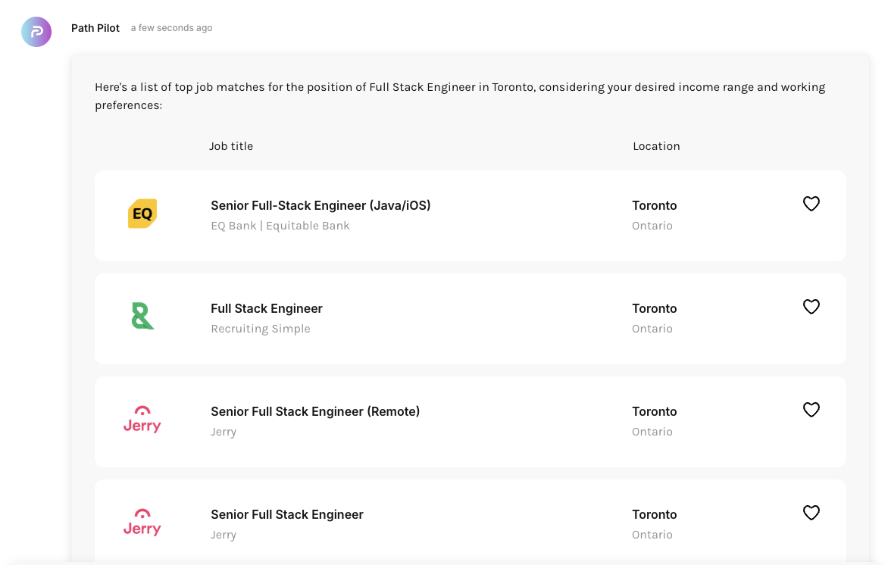

# Path Pilot Challenge
This project is a coding challenge centered around working with a frontend application that's handling the interaction of data returned from an LLM.

**Core Functionality:**

The application is designed to help users find job listings. It features an interface where users can input their job search criteria using natural language (e.g., "show me entry-level marketing roles in New York"). This natural language query is processed by a backend service integrated with the OpenAI API. The backend utilizes a specific function call to interpret the user's request and fetch relevant job postings.

**The Primary Challenge: Robust UI for Variable Data**

A significant challenge in this project stems from the nature of data returned by Large Language Models (LLMs) like OpenAI's. LLM outputs can sometimes be inconsistent or "flaky," meaning the structure and completeness or existence of the job data (e.g., job title, company, location, description, requirements) might vary between API responses if we rely purely on LLM's generated response.

**Objective:**

Jobs are currently returned in a markdown table format by the LLM as instructed by an internal prompt (inaccessible to you).
The main goal is to display returned job data in a way that can reliably presented regardless of data quality variations returned from the LLM. The goal is to modify the existing code base to:

1. **Parse Diverse Data:** Interpret and extract key job details from wherever you can to maintain the displayed data quality.
2. **Handle Imperfections:** Handle missing fields, weird formatting, or edge cases without crashing or looking broken.
3. **Present Clearly:** Show job listings in a clean, readable, and consistent way. Prioritize clarity even when some data is missing.
4. **Maintain Stability:** The data is streamed into the UI (like a chat), which can trigger frequent updates. Avoid flickering, layout shifts, or performance issues.
5. **Stay Performant:** Optimize for efficiency — minimize unnecessary re-renders or expensive parsing operations.

**Don't worry about Mobile, just focus on Desktop.**

**Instructions:**

Clone this repo and develop locally.
When done, please create a new public repo and upload your solution to it.
Please then email back Drew with a link to your solution.

## Example Design

Design isn’t the focus, so here's an example layout you can loosely follow. You’re encouraged to improve or adapt it if you have ideas for better handling inconsistencies, but no pressure!

# Build and run

In Terminal run:
1. `npm i`
2. `npm run start`

The app should now be running at http://127.0.0.1:3000
